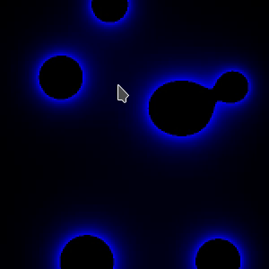

# C++ 2D Metaballs
2D interactive metaballs visualization

### Compile and run
- Make sure you have [SDL](https://www.libsdl.org/) installed
- Clone the repo `git clone https://github.com/sadracco/metaballs`
- `cd metaballs`
- Compile `make`or `g++ srd/*.cpp -lSDL2 -std=c++17 -o metaballs`
- Run `./metaballs`

### Resources
- [Wikipedia](https://en.wikipedia.org/wiki/Metaballs)
- [Ryan M. Geiss](http://www.geisswerks.com/ryan/BLOBS/blobs.html)

### Screenshots

